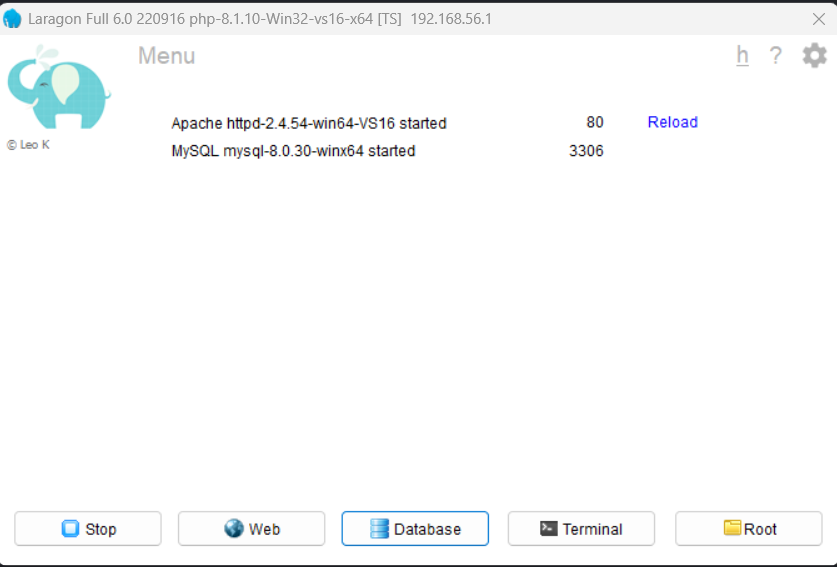

# 1 Setup MySQL Locally

#### Laragon is the easiest way to setup MySQL for beginners. in just under 5 minutes.

## Download Laragon

[https://github.com/leokhoa/laragon/releases?page=2#release-6.0.0](https://github.com/leokhoa/laragon/releases?page=2#release-6.0.0)

We will download 6.0 version because it's free. Versions higher than this are paid.

* click on **Assets Dropdown**
* click on **laragon-wamp.exe**, it will download Laragon

Now Install it.

<figure><figcaption></figcaption></figure>

<figure><figcaption></figcaption></figure>

### What is Laragon?

Laragon is a local web development tool. Helps us run MySQL locally, also provides phpmyadmin, which makes using mysql very easy.

You can visit [laragon.org](https://laragon.org) for more info.
